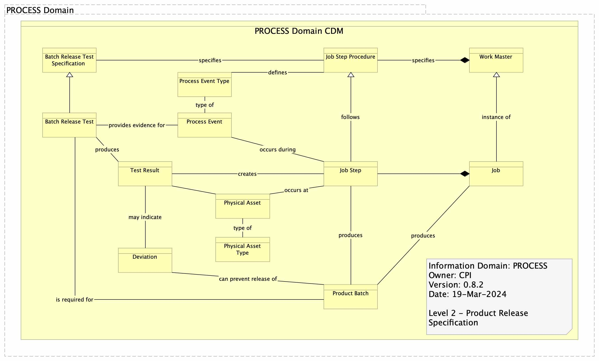

# PROCESS Domain Data Model

Here you will find the Logical Data Models for the PROCESS Domain for the Digital Membership Architecture for Medicines Manufacturing.

## Contents of this Repository

 - Graphical Models
 - raw JSON schemas of each domain entity
 - OpenAPI domain schema (as per the [SwaggerHub](https://support.smartbear.com/swaggerhub/docs/en/domains.html)

## Snapshot of the latest Model

The PROCESS LDM is derived from a recent version of the Domain Conceptual Data Model, baselined in the [MMIC Architecture Repository](https://github.com/mmic-collaboration/mmic-architecture-repository).

Here is a snapshot of the graphic (refer to the architecture repo for the definitions):

